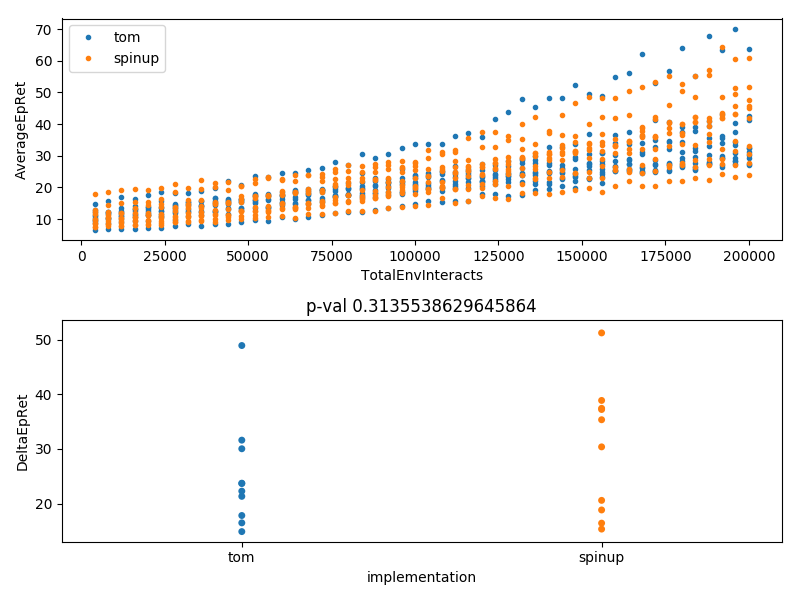

# Intro Deep-RL

## What is this?
The primary use of this repo is to store my attempts at deep reinforcement-learning algorithms, and benchmark them against the implementations in  [OpenAI's spinup](https://spinningup.openai.com/en/latest/) repository. This is my first attempt at deep reinforcement learning, hence the name.

## How can I use this?

Running this
```bash
$ deeprl benchmark -hid "(64,32)" --env_name InvertedPendulum-v2 -n 10
```
and waiting produces this



With the above line, we have run my VPG implementation against OpenAI's for 10 different random seeds. The top plot shows the history of the episode return. The bottom shows the change in the episode return over training for each implementation. To get a rough idea if the change in the return is meaningfully different between two implementations, I use student's t-test for independent samples to calculate the p-value shown.

I used [click](https://click.palletsprojects.com/en/7.x/) to make this nifty command-line-tool, which automatically gives you `--help` flags


```bash
$ deeprl --help
Usage: deeprl [OPTIONS] COMMAND [ARGS]...

  Main entry point

Options:
  --help  Show this message and exit.

Commands:
  benchmark  Benchmark tom's implementation against spinup and plot
  plot       plot Logging Results
  run        Run experiment and plot Episode Return
```

If we then want to know how to use "run", we can get help on that as well

```bash
$ deeprl run --help
Usage: deeprl run [OPTIONS]

  Run experiment and plot Episode Return

Options:
  -exp, --exp_name TEXT           Prefix added to experiment name
  -imp, --implementation [tom|spinup]
                                  Prefix added to experiment name
  -n, --num_runs INTEGER          Number of different random seeds to run
                                  [default: 3]
  --epochs INTEGER                Number of epochs  [default: 50]
  -steps, --steps_per_epoch INTEGER
                                  Number of epochs  [default: 4000]
  -env, --env_name TEXT           Environment name  [default: Swimmer-v2]
  -hid, --hidden_sizes TEXT       Hidden sizes for actor and critic MLPs
                                  [default: (64,64)]
  --activation TEXT               Activation to use in actor-critic MLPs
                                  [default: tanh]
  --help                          Show this message and exit.
```

## How do I install this?

```bash
git clone git@github.com:henighan/deeprl-intro.git
cd deeprl-intro
./install.sh
source .work/bin/activave
deeprl --help
```

## How do I test this?
```bash
py.test tests
```

If you want to use the mujoco environments, you will also need to follow the instructions [here](https://spinningup.openai.com/en/latest/user/installation.html#installing-mujoco-optional).

## Other notes

Thus far, I have only implemented VPG for diagonal gaussian policies. And even then, I stole OpenAI's buffer object. Now that I have tools to allow me to easily and quickly benchmark against spinup, I hope to make progress on implementing my own buffer, categorical policies, and more algorithms!
